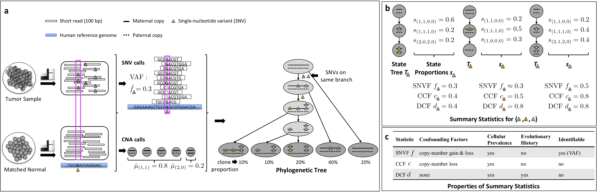
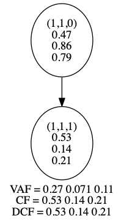

# decifer

DeCiFer is a method for copy-aware clustering of somatic single nucleotide variants by the descendant cell fraction.

## Contents

  1. [Compilation instructions](#compilation)
     * [Dependencies](#dep)
     * [Compilation](#comp)
  2. [Usage instructions](#usage)
     * [I/O format](#io)
     * [DeCiFer](#dcf)

## Compilation instructions

### Dependencies

DeCiFer is written in C++11 and thus requires a modern C++ compiler (GCC >= 4.8.1, or Clang). In addition, DeCiFer has the following dependencies.

* [CMake](http://www.cmake.org/) (>= 3.0)
* [Boost](http://www.boost.org) (>= 1.38)
* [LEMON](http://lemon.cs.elte.hu/trac/lemon) graph library (>= 1.3)
* A recent ILP Solver:
  * [Gurobi](http://www.gurobi.com) (>= 6.0)
  * [CPLEX](http://www.gurobi.com) (>= 12.0)

[Graphviz](http://www.graphviz.org) is required to visualize the resulting state tree DOT files, but is not required for compilation.
In case [doxygen](http://www.stack.nl/~dimitri/doxygen/) is available, extended source code documentation may be generated.

### Compilation

To compile DeCiFer, execute the following commands from the root of the repository:

    $ mkdir build
    $ cd build
    $ cmake ..
    $ make

By default DeCiFer will use the CPLEX ILP solver. To use Gurobi instead of CPLEX,  run the following command with adjusted paths:

    $ cmake -DLIBLEMON_ROOT=~/lemon -DCPLEX=OFF \
    -DGUROBI_INCLUDE_DIR=/usr/local/gurobi702/linux64/include \
    -DGUROBI_CPP_LIB=/usr/local/gurobi702/linux64/lib/libgurobi_c++.a \
    -DGUROBI_LIB=/usr/local/lib/libgurobi70.so ..

The compilation results in the following files in the `build` directory:

EXECUTABLE | DESCRIPTION
-----------|-------------
`decifer` | Infer evolutionary history and cellular prevalence of somatic single-nucleotide variants using a combinatorial algorithm based on the descendant cell fraction.
`summarize` | Extracts hard clustering from DeCiFer soft clustering.
`visualizepoststatetree` | Visualizes a state tree identified by DeCiFer.

### Example execution

Input file specifies the number of reference and variant read counts for each SNV in each sample in addition to the copy number state (number of maternal, number of paternal and proportion).

    $ cat ../../data/sims/m3_n100_k3_C200_s1.input.tsv | head
    3 #samples
    100 #characters
    #sample_index	sample_label	character_index	character_label	ref	var
    0	sample_1	0	SNV_1	149	51	1	1	1
    0	sample_1	1	SNV_2	128	76	1	1	0.384968	3	2	0.615032
    0	sample_1	2	SNV_3	104	75	1	1	1
    0	sample_1	3	SNV_4	164	25	1	1	0.439634	3	2	0.560366
    0	sample_1	4	SNV_5	155	51	1	1	1
    0	sample_1	5	SNV_6	140	57	1	1	0.990122	2	2	0.00987817
    0	sample_1	6	SNV_7	131	84	1	1	1

Here's an example invocation of DeCiFer:

    $ ./decifer -bic -k 5 -tl 30 -i 10 ../../data/sims/m3_n100_k3_C200_s1.input.tsv

In the above command DeCiFer uses the Bayesian Information Criterion (BIC) to  select the number of clusters (`-bic`). The maximum number of clusters is to `-k 5`, and we use a time limit of `-tl 10` seconds to solve the hard clustering problem used for initialization. Each number of clusters uses `-i 10` restarts. We obtain the following files:

    $ ls -alFh output*
    -rw-r--r--  1 melkebir  staff   176B Nov 17 14:24 output.BIC.tsv
    -rw-r--r--  1 melkebir  staff   2.4K Nov 17 14:08 output_k2.SNV.tsv
    -rw-r--r--  1 melkebir  staff    17K Nov 17 14:08 output_k2.T.res
    -rw-r--r--  1 melkebir  staff   2.9K Nov 17 14:10 output_k3.SNV.tsv
    -rw-r--r--  1 melkebir  staff    27K Nov 17 14:10 output_k3.T.res
    -rw-r--r--  1 melkebir  staff   3.4K Nov 17 14:16 output_k4.SNV.tsv
    -rw-r--r--  1 melkebir  staff    38K Nov 17 14:16 output_k4.T.res
    -rw-r--r--  1 melkebir  staff   3.8K Nov 17 14:21 output_k5.SNV.tsv
    -rw-r--r--  1 melkebir  staff    41K Nov 17 14:21 output_k5.T.res

BIC results are given in `output.BIC.tsv`:

    $ cat output.BIC.tsv
    k	loglikelihood	observations	parameters	BIC
    1	-1.79769e+308	1923	6	inf
    2	-1340.66	1923	9	2749.37
    3	-1064.03	1923	12	2218.8
    4	-1065.51	1923	15	2244.45
    5	-1068.4	1923	18	2272.91

We can see that k=3 has the smallest BIC value. The corresponding clustering is given in `output_k3.SNV.tsv`:

    $ cat output_k3.SNV.tsv
    SNV	cluster0	cluster1	cluster2	cluster	dcf0	dcf1	dcf2
    0	1	0	0.00019	0	0.53	0.14	0.21
    1	0	0	1	2	0.73	0.19	0.29
    2	0	1	0	1	0.87	0.96	0.86
    3	1	0	0	0	0.53	0.14	0.21
    4	1	0	0.0021	0	0.53	0.14	0.21
    5	1	0	0.0023	0	0.53	0.14	0.21
    6	0.00035	0	1	2	0.73	0.19	0.29
    7	1.2e-05	0	1	2	0.73	0.19	0.29
    8	0	1	0	1	0.87	0.96	0.86
    

The first column specified the SNV identifier (`SNV`), followed by the posterior probability of belonging to each of the k=3 clusters (columns `cluster0`, `cluster1` and `cluster2`). Then, the cluster with maximum posterior probability is given in column `cluster`. Finally, the DCF of the SNV in each of the three input samples is given (`dcf0`, `dcf1` and `dcf2`).

We obtain a summary of the results using the command `summarize`:

    $ ./summarize ../../data/sims/m3_n100_k3_C200_s1.input.tsv output_k3.T.res 
    SNV_index	SNV_label	sample_index	sample_label	ref	alt	VAF	sanger_n_mut	sanger_CCF	decifer_CCF	decifer_DCF	decifer_cluster_CCF	decifer_cluster_DCF	decifer_cluster_index	decifer_state_tree_index	nr_nonzero_z
    0	SNV_1	0	sample_1	149	51	0.255	1	0.51	0.51	0.51	0.534591	0.534591	0	0	1
    0	SNV_1	1	sample_2	172	11	0.0601093	1	0.120219	0.120219	0.120219	0.14178	0.14178	0	0	1 
    ...

The `decifer_state_tree_index` column in the output of the above command tells us which state tree resulted in the maximum posterior probability for each SNV in each sample. We can visualize this state tree as follows.

    $ ./visualizepoststatetree -i 0 -t 0 -m 3 output_k3.T.res | dot -Tpng -o ../../doc/example.png

